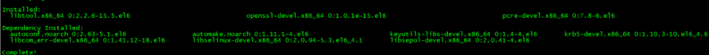
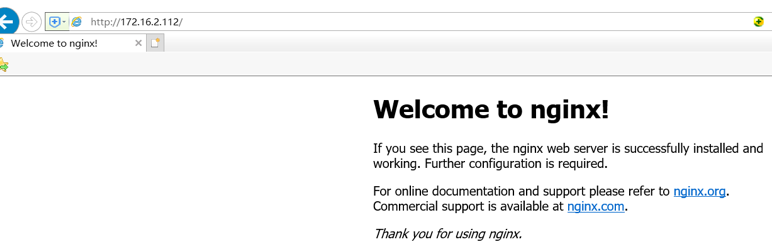

# 安装应用软件

## 介质

**程序目录**

mkdir -p /u01/software
chown -R hdm:dba /u01
**下载介质**
hdm用户上传介质
apache-tomcat-8.5.8.tar.gz
fmw_12.2.1.3.0_wls_Disk1_1of1.zip
vnc-4_1_2-x86_win32_viewer.exe
jdk-8u181-linux-x64.tar.gz
apache-maven-3.3.9-bin.tar.gz
redis-3.2.9.tar.gz
core.war
core-db.zip
## 配置java环境

新建java路径

mkdir –p /usr/java

解压jdk到java路径下

[root\@HDM software]\# tar -xzvf jdk-8u181-linux-x64.tar.gz -C /usr/java/

设置hdm用户的java变量。
编辑.bash_profile，添加如下内容：
```
export PATH=/usr/java/jdk1.8.0_181/bin:\$PATH:\$HOME/bin

export JAVA_HOME=/usr/java/jdk1.8.0_181

export JRE_HOME=/usr/java/jdk1.8.0_131/jre
```

重新加载环境变量
```
[hdm\@HDM \~]\$ source .bash_profile
```
检查是否生效
```
[hdm\@HDM \~]\$ java –version
```


已经生效
## 安装tomcat(可选)
**下载tomcat**
本次安装的tomcat介质：apache-tomcat-8.5.8.tar.gz
**安装tomcat**
```
mkdir /u01/HDM
cd /u01/HDM
tar -zxvf /u01/software/apache-tomcat-8.5.8.tar.gz
```

**启动tomcat**

```
/u01/HDM/apache-tomcat-8.5.8/bin/startup.sh
```

```
[hdm@hdm01 bin]$ /u01/HDM/apache-tomcat-8.5.8/bin/startup.sh
Using CATALINA_BASE:   /u01/HDM/apache-tomcat-8.5.8
Using CATALINA_HOME:   /u01/HDM/apache-tomcat-8.5.8
Using CATALINA_TMPDIR: /u01/HDM/apache-tomcat-8.5.8/temp
Using JRE_HOME:        /usr
Using CLASSPATH:       /u01/HDM/apache-tomcat-8.5.8/bin/bootstrap.jar:/u01/HDM/apache-tomcat-8.5.8/bin/tomcat-juli.jar
Tomcat started.
[hdm@hdm01 bin]$
```

启动port端口为8080
对应的停止脚本

```
/u01/HDM/apache-tomcat-8.5.8/bin/shutdown.sh
```

## 安装weblogic(可选)

**weblogic软件**

在官网下载weblogic软件，上传服务器，解压安装。用户hdm启动vnc，在vnc中安装weblogic

```
[hdm\@HDM software]\$ unzip fmw_12.2.1.3.0_wls_Disk1_1of1.zip

[hdm\@HDM software]\$ java -jar fmw_12.2.1.3.0_wls.jar
```


```
/u01/weblogic/Oracle/Middleware/Oracle_Home
```


**创建配置新的域**


密码设置为：********


输入上面的账户密码：weblogic/********


安装完成

**信息访问**

**启停**

启动：

```
[hdm\@HDM \~]\$ cd
/u01/weblogic/Oracle/Middleware/Oracle_Home/user_projects/domains/base_domain/bin/
./startWebLogic.sh
```

用这个命令进程不会再后台运行，也就是启动命令的shell窗口不能管理，可以通过下面的方式来启动

```
 nohup sh ./startWebLogic.sh &
```

停止：

```
./stopWebLogic.sh
```

**Weblogic访问信息**
Login URL:http://172.16.2.213:7001/console
用户密码:weblogic/\*\*\*\*\*\*
## 安装redis
**下载redis**
安装的redis介质：redis-3.2.5.tar.gz
**安装redis**

```
cd /u01/HDM
tar -zxvf /u01/software/redis-3.2.5.tar.gz
cd /u01/HDM/redis-3.2.5
sudo make 
```

日志会留下如下：

```
make[1]: Leaving directory `/u01/HDM/redis-3.2.5/src'
```

```
cd /u01/HDM/redis-3.2.5/src
mkdir /u01/HDM/redis-3.2.5/redis
sudo make install  PREFIX=/u01/HDM/redis-3.2.5/redis
```

```
日志：
Hint: It's a good idea to run 'make test' ;)
    INSTALL install
    INSTALL install
    INSTALL install
    INSTALL install
    INSTALL install
```

**配置文件**
先新建文件夹mkdir 

```
/u01/HDM/redis-3.2.5/logs
vi /u01/HDM/redis-3.2.5/redis.conf
```

启动port端口为6379
将daemonize的值改为yes
logs

```
pidfile /u01/HDM/redis-3.2.5/logs/redis_6379.pid
logfile "/u01/HDM/redis-3.2.5/logs/redis.log"
dir /u01/HDM/redis-3.2.5/logs
```

**启动redis**
Redis放在服务器后台运行，修改配置文件属性：
将daemonize的值改为yes （默认值为no）


启动命令：

```
/u01/HDM/redis-3.2.5/redis/bin/redis-server  /u01/HDM/redis-3.2.5/redis.conf
```

停止命令：

```
/u01/HDM/redis-3.2.5/redis/bin/redis-cli shutdown
　　或者
pkill redis-server
```

## 安装maven
**说明**
安装maven
**下载maven**
URL: http://maven.apache.org/download.cgi
本次安装的maven介质如下：apache-maven-3.3.9-bin.tar.gz
**安装maven**

```
cd /u01/HDM
tar -zxvf /u01/software/apache-maven-3.3.9-bin.tar.gz
```

**永久环境变量**
编辑.bash_profile

```
vi /home/hdm/.bash_profile
```
添加如下内容：
```
export MAVEN_HOME= /u01/HDM/apache-maven-3.3.9
export PATH=${MAVEN_HOME}/bin:${PATH}
export PATH=$PATH:/u01/HDM/redis-3.2.5/redis/bin
export CATALINA_HOME=/u01/HDM/apache-tomcat-8.5.8
export CATALINE_BASH=/u01/HDM/apache-tomcat-8.5.8
```

重新加载环境变量

```
[hdm\@HDM \~]\$ source .bash_profile
```

**安装后验证**

```
[hdm@HDM ~]$ mvn -v
Apache Maven 3.3.9 (bb52d8502b132ec0a5a3f4c09453c07478323dc5; 2015-11-11T00:41:47+08:00)
Maven home: /u01/HDM/apache-maven-3.3.9
Java version: 1.8.0_111, vendor: Oracle Corporation
Java home: /u01/HDM/jdk1.8.0_111/jre
Default locale: en_US, platform encoding: UTF-8
OS name: "linux", version: "2.6.32-358.el6.x86_64", arch: "amd64", family: "unix"
```

注：修改文件后要想马上生效还要运行$ source /home/hdm/.bash_profile不然只能在下次重进此用户时生效。
# 配置
## HDM准备
### 配置数据库
**创建表空间**

```
CREATE TABLESPACE "HDM_DATA" 
    LOGGING 
    DATAFILE '/u01/app/oracle/oradata/HYTST/hdm_data01.dbf' SIZE 1000M 
    AUTOEXTEND 
    ON NEXT  100M MAXSIZE  8000M EXTENT MANAGEMENT LOCAL SEGMENT 
SPACE MANAGEMENT  AUTO;
```

**创建数据库用户**

```
create user hdm identified by z8MhZismTJ default tablespace HDM_DATA TEMPORARY TABLESPACE "TEMP";
```

**授权**

```
grant connect ,resource,create view,create any directory ,create database link to hdm;
```

```
cd /u01/HDM
unzip /u01/software/core-db.zip
[hdm@hdm01 core-db]$ pwd
/u01/HDM/core-db
```

**编译（需要连接外网)**
(该操作只需要在一台机器上执行，第二个节点可以考虑直接拷贝core.war包)
在源码文件夹下执行：mvn clean install
例：

```
cd  /u01/HDM/core-db
mvn clean install
```

(日志显示download的包，存放在当前用户/home/user/.m2下，该部分可以拷贝)
**初始化数据到hdm用户（只需要在一台机器上执行）**
编译成功后，执行初始化数据库命令：

```
mvn process-resources -D skipLiquibaseRun=false -D db.driver=oracle.jdbc.driver.OracleDriver -D db.url=jdbc:oracle:thin:@ys-dbtest.jingpai.com:1531:HYTST -Ddb.user=hdm -Ddb.password=z8MhZismTJ
```

```
[INFO] Reactor Summary:
[INFO] core-db ............................................ SUCCESS [  1.073 s]
[INFO] ------------------------------------------------------------------------
[INFO] BUILD SUCCESS
[INFO] ------------------------------------------------------------------------
[INFO] Total time: 39.836 s
[INFO] Finished at: 2017-02-09T09:55:50+08:00
[INFO] Final Memory: 68M/974M
[INFO] ------------------------------------------------------------------------
[hdm@hdm01 core-db]$
```

## tomcat部署HDM
**修改tomcat**
修改tomcat目录（/u01/HDM/apache-tomcat-8.5.8/conf）下的conf/context.xml,在最后面添加如下配置：

```
<Resource auth="Container" driverClassName="oracle.jdbc.driver.OracleDriver" name="jdbc/hbi_dev" type="javax.sql.DataSource" url="jdbc:oracle:thin:@ys-dbtest.jingpai.com:1531:HYTST" username="hdm" password="z8MhZismTJ"/>
```

本次截图：
**拷贝war包**
将源代码目录下/core/target/core.war拷贝到tomcat的webapps目录下，
注意：模板文件上传路径默认如下：


需要更改文件存储路径的，可修改配置文件，修改方式为：可将core.war先重命名为core.zip，找到core.zip\WEB-INF\classes路径下config.properties文件，进行相应修改。若修改此配置文件，则以后每次更新系统，都需要修改配置文件。

```
cp /u01/HDM/hbiparent/core/target/core.war /u01/HDM/apache-tomcat-8.5.8/webapps
$ls -l /u01/HDM/apache-tomcat-8.5.8/webapps/core.war 
-rw-r--r--. 1 hdm dba 127410530 Feb  9 10:04 /u01/HDM/apache-tomcat-8.5.8/webapps/core.war
```

**访问url（两个节点同样的安装方式）**
通过http://<ip>:<prot>/core访问hdm，
http://172.16.2.112:8080/core
http://172.16.2.113:8080/core
初始用户admin/admin
## weblogic部署HDM
HDM应用的部署是在weblogic控制台进行的。
**weblogic登陆**
登录地址：<http://172.16.2.213:7001/console>
用户密码
weblogic/\*\*\*\*\*\*
### 数据源配置
weblogic主页--服务--数据源


新建数据源


依次填写数据库名称、主机名、端口号、数据库用户名、口令


(注：以上信息根据实际情况填写)

下一步确认数据库信息无误后，下一步勾选服务器


点击完成后，测试数据源


数据源创建成功。

### 应用部署

在域结构中选择base_domain部署


在右侧的部署概要页面选择按钮：安装


下一步选择HDM应用所在core目录


然后默认下一步


然后默认下一步


点击下一步，复查选项后点击完成部署。

**HDM访问**
http://服务器ip:7001/core/login

账号密码 admin/admin
# 服务管理
## tomcat
### 启动脚本
StartHDM.sh

```
#Start tomcat 
/u01/HDM/apache-tomcat-8.5.8/bin/startup.sh &
#Start Redis 
/u01/software/redis-3.2.5/redis /bin/redis-server /u01/software/redis-3.2.5/redis.conf
```

### 停止脚本
StopHDM.sh

```
#Stop tomcat
/u01/HDM/apache-tomcat-8.5.8/bin/shutdown.sh
#Stop Redis 
/u01/software/redis-3.2.5/redis /bin/redis-cli shutdown 
```

## weblogic
### 启动脚本

StartHDM.sh

```
#Start Weblogic 
cd /u01/weblogic/Oracle/Middleware/Oracle_Home/user_projects/domains/ base_domain/bin/ 
nohup ./startWebLogic.sh & 
#Start Redis 
/u01/software/redis-3.2.5/redis /bin/redis-server /u01/software/redis-3.2.5/redis.conf
```

### 停止脚本

StopHDM.sh

```
#Stop Weblogic 
cd /u01/weblogic/Oracle/Middleware/Oracle_Home/user_projects/domains/ base_domain/bin/ 
nohup ./stopWebLogic.sh & 
#Stop Redis 
/u01/software/redis-3.2.5/redis /bin/redis-cli shutdown 
```
## HDM备份恢复
### 应用层备份恢复
导出：


导入：


（主数据相关功能均有导入导出）
### 模板备份
把/u01/hdm/template_excel路径下数据模板批量拷贝或者在数据录入打开表单点击模板下载备份到svn、vss或其他项目文档管理工具


### 数据库备份恢复
导出命令：
expdp hdm/hdmwelcome! DUMPFILE=HDM_0330.dmp  DIRECTORY=DATA_PUMP_DIR SCHEMAS=HDM LOGFILE=HDM_0330.log;
导入命令：
impdp scott/tiger DIRECTORY=dpdata1 DUMPFILE=expdp.dmp SCHEMAS=scott;

## 负载均衡
**下载软件**
从http://nginx.org/en/download.html下载nginx
nginx-1.14.0.tar.gz

root用户操作：
创建如下路径，并将介质上传到hdm01节点/lb/software
解压： 

```
cd /lb/software
tar -zxvf nginx-1.14.0.tar.gz
```

**安装nginx**
root用户操作：
安装必须rpm包

```
yum -y install gcc gcc-c++ make libtool zlib zlib-devel openssl openssl-devel pcre pcre-devel
```



安装nginx

```
cd /lb/software/nginx-1.14.0
./configure --prefix=/lb/nginx \
--with-http_stub_status_module \
--with-http_ssl_module
```


 make
 

 make install
 

安装完成查看结果


**nginx服务启停**
root用户操作：

启动nginx

```
 /lb/nginx/sbin/nginx
```

关闭nginx（会默认重启）

```
 /lb/nginx/sbin/nginx -s stop
```

登录测试(缺省端口为80)


设置nginx开机自动启动---【待验证】
创建/etc/init.d/nginx文件，内容如下:

```
 chmod 755 /etc/init.d/nginx
 chkconfig --add nginx
 chkconfig nginx on
```

**配置nginx**
root用户操作：

配置nginx，修改/lb/nginx/conf/nginx.conf

```
upstream  ys-hdmtest1.jingpai.com {
    ip_hash;
    server 172.16.2.112:8080;
    server 172.16.2.113:8080;
    }
server {
        listen       80;
        server_name  location;

        #charset koi8-r;

        #access_log  logs/host.access.log  main;

        location / {
            proxy_pass http://ys-hdmtest1.jingpai.com;
            proxy_set_header Host $host;
            proxy_set_header X-Real-IP $remote_addr;
            proxy_set_header X-Forwarded-For $proxy_add_x_forwarded_for;
            root   html;
            index  index.html index.htm;
        }
```

**访问url（nginx在hdm01设置后）**
访问hdm，
http://ys-hdmtest1.jingpai.com/core
初始用户admin/admin

## 共享文件夹设置
>此操作是做了负载均衡的项目需要完成的，用于模板上传文件的共享，未做负载均衡的项目不需要执行以下操作。此处假设模板上传路径（拷贝war包时配置的路径）为/u01/hdm/template_excel，在hdm用户下创建该目录(每台服务器都需要创建)。

**sh查看本机是否安装了nfs服务器**
rpm -qa|grep nfs
rpm -qa|grep rpcbind


出现以上提示信息，则已经安装了nfs服务器，否则需要手动安装。
yum install rpcbind
yum install  nfs-utils
**修改nfs主配置文件/etc/exports**
创建用于共享的目录
mkdir /u01/hdm/sharefile //(此命令在hdm用户下执行，其余均在root用户下执行)
vi /etc/exports
添加以下信息


其中，
/u01/hdm/sharefile:允许客户端挂载的目录，可添加任意多个，如果不设置，服务器将不允许客户端挂载。
172.16.2.112,172.16.2.113:允许该IP的主机挂载该目录（可设置为范围比如：192.168.10.*），地址可以使用完整IP或网段，例如10.0.0.8或10.0.0.0/24，10.0.0.0/255.255.255.0当然也可以地址可以使用主机名，DNS解析的和本地/etc/hosts解析的都行，支持通配符，如：*.chengyongxu.com。

```
括号内的 :一些权限设置
   rw：read-write，可读写；    注意，仅仅这里设置成读写客户端还是不能正常写入，还要正确地设置共享目录的权限  
   ro：read-only，只读；  
   sync：文件同时写入硬盘和内存；  
   async：文件暂存于内存，而不是直接写入内存；  
   no_root_squash：NFS客户端连接服务端时如果使用的是root的话，那么对服务端分享的目录来说，也拥有root权限。显然开启这项是不安全的。  
   root_squash：NFS客户端连接服务端时如果使用的是root的话，那么对服务端分享的目录来说，拥有匿名用户权限，通常他将使用nobody或nfsnobody身份；  
   all_squash：不论NFS客户端连接服务端时使用什么用户，对服务端分享的目录来说都是拥有匿名用户权限；  
   anonuid：匿名用户的UID值，通常是nobody或nfsnobody，可以在此处自行设定；  
   anongid：匿名用户的GID值。
```

**启用nfs相关服务程序**
service rpcbind start
service nfs start
设置开机自启
chkconfig --list nfs
chkconfig --list rpcbind
查看已经声明过的可被挂载的目录


注意：需要将服务器防火墙关闭。
**客户机操作**
从客户机查看服务端的nfs共享资源列表
showmount -e 172.16.2.113


从客户机172.16.2.112上挂载/u01/hdm/sharefile共享。
mount 172.16.2.113:/u01/hdm/sharefile /u01/hdm/template_excel //将共享目录挂载到本地/u01/hdm/template_excel目录下
查看挂载信息
df -h


**设置开机后自动挂载nfs共享资源（客户机操作）**
vi /etc/fstab
添加以下语句：
172.16.2.113:/u01/hdm/sharefile /u01/hdm/template_excel nfs defaults 0 0


mount -a  //无提示信息则说明挂载成功