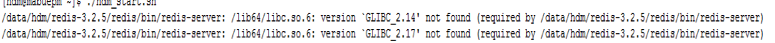
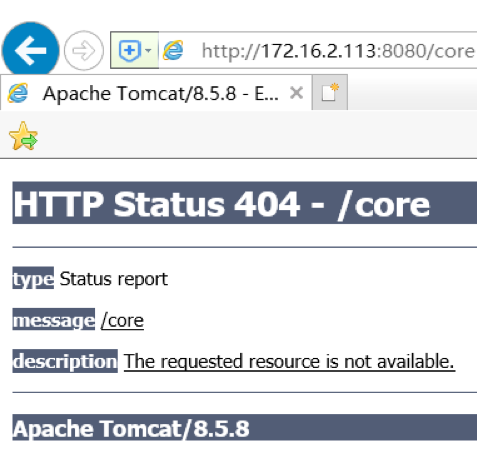
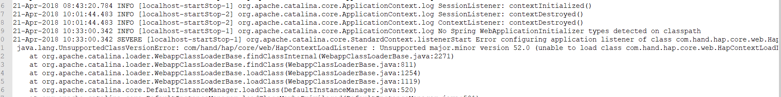
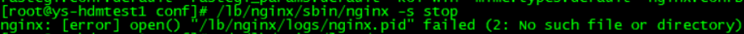
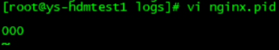
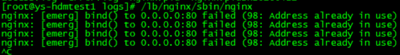

# 疑难问题集

## 错误1 redis无法正常启停

####问题1
权限不够，导致redis无法正常启停

#####错误日志
```
2481:M 08 Feb 15:07:57.716 # User requested shutdown...
2481:M 08 Feb 15:07:57.716 * Saving the final RDB snapshot before exiting.
2481:M 08 Feb 15:07:57.716 # Failed opening the RDB file dump.rdb (in server root dir /u01/HDM/redis-3.2.5/redis/bin) for saving: Permission denied
2481:M 08 Feb 15:07:57.716 # Error trying to save the DB, can't exit.
```
#####处理方式
原因是由于hdm无权限写dump文件，修改dump路径可以成功解决该问题
修改配置文件/u01/HDM/redis-3.2.5/redis.conf的dump路径
**dir /u01/HDM/redis-3.2.5/logs**

####问题2
GLIBC版本不够，导致Redis无法正常启停
#####错误日志

#####处理方式
######1、服务器上glibc库的版本是2.12，需要升级到2.17版本。
下载地址：
http://ftp.gnu.org/gnu/glibc/glibc-2.17.tar.gz
（这里可以选择你所需要的版本）
######2、安装部署
```
[hdm@mabuepm hdm]# tar -xf glibc-2.17.tar.gz
[hdm@mabuepm hdm]# cd glibc-2.17
[hdm@mabuepm glibc-2.17]# mkdir build; cd build
[hdm@mabuepm build]# ../configure --prefix=/usr --disable-profile --enable-add-ons --with-headers=/usr/include --with-binutils=/usr/bin
[hdm@mabuepm build]# make -j 16
[hdm@mabuepm build]# make  install
[hdm@mabuepm hdm]# strings /lib64/libc.so.6 | grep GLIBC
[hdm@mabuepm hdm]$ strings /lib64/libc.so.6 | grep GLIBC
GLIBC_2.2.5
GLIBC_2.2.6
GLIBC_2.3
GLIBC_2.3.2
GLIBC_2.3.3
GLIBC_2.3.4
GLIBC_2.4
GLIBC_2.5
GLIBC_2.6
GLIBC_2.7
GLIBC_2.8
GLIBC_2.9
GLIBC_2.10
GLIBC_2.11
GLIBC_2.12
GLIBC_2.13
GLIBC_2.14
GLIBC_2.15
GLIBC_2.16
GLIBC_2.17
GLIBC_PRIVATE
```
我们可以看到部署成功后的glibc的版本为2.17 
```
[hdm@mabuepm hdm]$ ldd --version
ldd (GNU libc) 2.12
Copyright (C) 2010 Free Software Foundation, Inc.
This is free software; see the source for copying conditions.  There is NO
warranty; not even for MERCHANTABILITY or FITNESS FOR A PARTICULAR PURPOSE.
Written by Roland McGrath and Ulrich Drepper.
```
如若未升级成功，可以尝试重启服务器后再查看版本即可。
##错误2 tomcat启动报错too low setting for -Xss
####问题
tomcat启动报错too low setting for ?Xss，导致系统无法登陆
####错误日志
```
Caused by: java.lang.IllegalStateException: Unable to complete the scan for annotations for web application [/core] due to a StackOverflowError. Possible root causes include a too low setting for -Xss and illegal cyclic inheritance dependencies. The class hierarchy being processed was [org.bouncycastle.asn1.ASN1EncodableVector->
```
####处理方式
因为tomcat启动会去扫描jar包，看错误信息org.bouncycastle.asn1.ASN1EncodableVector，是出在这个类，这个类似出现在bcprov*.jar这个包，所以在tomcat的conf目录里面catalina.properties的文件，
在tomcat.util.scan.DefaultJarScanner.jarsToSkip=里面加上bcprov*.jar过滤,如下：
修改：/u01/HDM/apache-tomcat-8.5.8/conf/catalina.properties
在tomcat.util.scan.StandardJarScanFilter.jarsToSkip尾部添加bcprov*.jar下：
```
tomcat.util.scan.StandardJarScanFilter.jarsToSkip=\
………………….
jetty-*.jar,oro-*.jar,servlet-api-*.jar,tagsoup-*.jar,xmlParserAPIs-*.jar,\
xom-*.jar,bcprov*.jar
```
##错误3
登录HDM报 HTTP Status 404
####问题
打开浏览器登录HDM报 HTTP Status 404 - /core

####错误日志
查看tomcat的Catalina.out日志

```yaml
21-Apr-2018 10:54:09.845 INFO [localhost-startStop-1] org.apache.catalina.startup.HostConfig.deployWAR Deploying web application archive /u01/HDM/apache-tomcat-8.5.8/webapps/core.war
21-Apr-2018 10:54:18.638 INFO [localhost-startStop-1] org.apache.jasper.servlet.TldScanner.scanJars At least one JAR was scanned for TLDs yet contained no TLDs. Enable debug logging for this logger for a complete list of JARs that were scanned but no TLDs were found in them. Skipping unneeded JARs during scanning can improve startup time and JSP compilation time.
21-Apr-2018 10:54:18.666 SEVERE [localhost-startStop-1] org.apache.catalina.core.StandardContext.startInternal One or more listeners failed to start. Full details will be found in the appropriate container log file
21-Apr-2018 10:54:18.670 SEVERE [localhost-startStop-1] org.apache.catalina.core.StandardContext.startInternal Context [/core] startup failed due to previous errors
21-Apr-2018 10:54:18.665 SEVERE [localhost-startStop-1] org.apache.catalina.core.StandardContext.listenerStart Error configuring application listener of class hbi.core.hdm.utils.HdmConLoadListener
 java.lang.UnsupportedClassVersionError: hbi/core/hdm/utils/HdmConLoadListener : Unsupported major.minor version 52.0 (unable to load class hbi.core.hdm.utils.HdmConLoadListener)
```
####处理方式
将环境变量写入用户hdm的.bash_profile文件，见”添加永久环境变量”
##错误4
停止nginx报No such file
####问题
停止nginx服务报No such file错误

####错误日志
```
nginx: [error] open() "/lb/nginx/logs/nginx.pid" failed (2: No such file or directory)
```
####处理方式
在/lb/nginx/logs下建文件nginx.pid，任意输入一个数字

##错误5启动nginx报Address already in use
####问题
启动nginx报Address already in use错误

####错误日志
```
nginx: [emerg] bind() to 0.0.0.0:80 failed (98: Address already in use)
```
####处理方式
说明80端口被占用，杀掉这个进程：
killall -9 nginx
