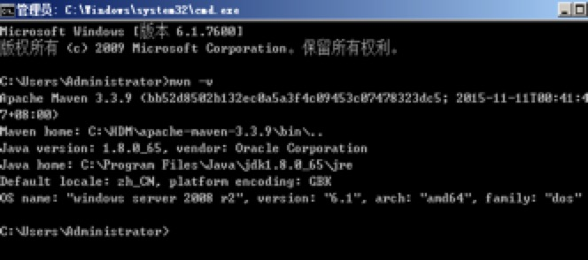
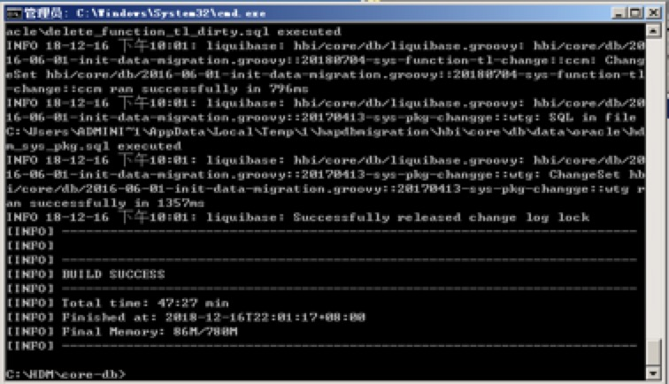
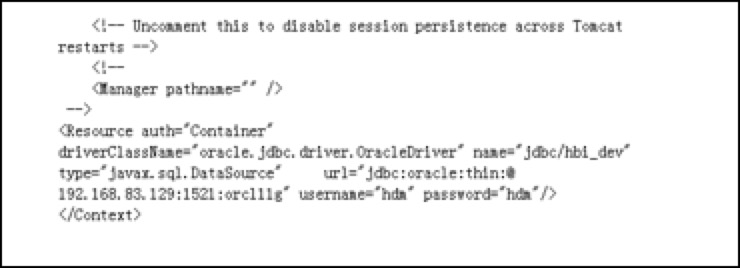

# 安装应用软件

## 介质

####程序目录
E:\HFM\install_Software\HDM
####安装介质
apache-maven-3.3.9-bin.zip
apache-tomcat-8.0.32-windows-x64.zip
jdk-8u121-windows-x64.exe
（jdk版本1.8以上，可根据电脑配置安装32位或64位jdk）
Redis-x64-3.2.100.zip
nginx-1.15.11.zip
core.war
core-db.rar
##安装jdk
 双击运行安装文件 jdk-8u121-windows-x64.exe(详略)
 Jdk环境变量设置
```
 JAVA_HOME=E:\HFM\HDM\Java\jdk1.8.0_121
 PATH=%JAVA_HOME%\bin;%PATH%
 JAVA_BIN=%JAVA_HOME%\bin
 JAVA_LIB=%JAVA_HOME%\lib
 CLASSPATH=.;%JAVA_LIB%\tools.jar;%JAVA_LIB%\dt.jar
```
 java -version查看jdk版本
## 安装tomcat
####下载tomcat
tomcat介质：apache-tomcat-8.0.32-windows-x64.zip
####安装tomcat
解压压缩包apache-tomcat-8.0.32-windows-x64.zip 
####启动tomcat
（需提前安装配置好JAVA，启动port端口为8080）
```
E:\HFM\HDM\apache-tomcat-8.0.32\bin\startup.bat
```
对应的停止脚本
```
E:\HFM\HDM\apache-tomcat-8.0.32\bin\shutdown.sh
```
## 安装redis
####下载redis

本次安装的redis介质：Redis-x64-3.2.100.zip

####安装redis

解压文件：Redis-x64-3.2.100.zip
cd E:\HFM\HDM\Redis-x64-3.2.100

####配置文件
```
E:\HFM\HDM\Redis-x64-3.2.100\redis.windows.conf
```
1. 启动port端口为6379
2. 将daemonize的值改为yes（这是设置后台运行，可以不操作）
 	Redis放在服务器后台运行，修改配置文件属性：
   将daemonize的值改为yes （默认值为no）
3. logs

```
pidfile E:\HFM\HDM\Redis-x64-3.2.100\logs\redis_6380.pid
logfile "E:\HFM\HDM\Redis-x64-3.2.100\logs\redis.log"
dir E:\HFM\HDM\Redis-x64-3.2.100\logs
```

####启动redis
启动命令：
```
C:\HDM\Redis-x64-3.2.100\ redis-server.exe
```

##安装maven部署工具
####说明
安装maven
####下载maven
URL: http://maven.apache.org/download.cgi
本次安装的maven介质如下：apache-maven-3.3.9-bin.zip
####安装maven
解压文件到指定目录：apache-maven-3.3.9-bin.zip
####环境变量
配置maven的环境变量
```
MAVEN_HOME= E:\HFM\HDM\apache-maven-3.3.9
CATALINA_HOME= E:\HFM\HDM\apache-tomcat-8.0.32
CATALINA_BASH= E:\HFM\HDM\apache-tomcat-8.0.32
```
####安装后验证

#配置
##配置数据库
####创建表空间
```yaml
create tablespace TS_HDM
datafile 'TS_HDM.dbf' size 50M
autoextend on next 50M maxsize unlimited logging
extent management local autoallocate
segment space management auto;
```
####创建数据库用户
```yaml
create user hdm ---用户名
identified by hdm---密码
default tablespace TS_HDM ---表空间名
temporary tablespace TEMP
profile DEFAULT;
```
####授权
```yaml
-- Grant/Revoke role privileges 
grant resource to hdm; 
-- Grant/Revoke system privileges 
grant create session to hdm;
grant create view to hdm;
grant unlimited tablespace to hdm;
```
##配置应用
####源代码
解压core-db.rar
####编译（需要连接外网）
(该操作只需要在一台机器上执行，第二个节点可以考虑直接拷贝core.war包)
初始化数据到hdm用户
```yaml
在C:\HDM\core-db 路径下cmd命令窗口执行初始化数据库命令（耐心等待）：
mvn clean install
```
####初始化数据到hdm用户（只需要在一台机器上执行）
编译成功后，执行初始化数据库命令：
```yaml
mvn process-resources -D skipLiquibaseRun=false -D db.driver=oracle.jdbc.driver.OracleDriver -D db.url=jdbc:oracle:thin:@localhost:1521:orcl11g -Ddb.user=hdm -D db.password=hdm
```


####修改tomcat
修改tomcat目录下的conf/context.xml,在最后面添加如下配置：
```yaml
<Resource auth="Container" driverClassName="oracle.jdbc.driver.OracleDriver" name="jdbc/hbi_dev" type="javax.sql.DataSource"     url="jdbc:oracle:thin:@ localhost:1521:orcl11g" username="hdm" password="hdm"/>
```

####拷贝war包
将core.war拷贝到tomcat的webapps目录(C:\HDM\apache-tomcat-8.0.32\webapps)下
注意：模板文件上传路径默认如下：
####服务启停
启动Oracle数据库，开始->服务，在服务面板中启动一下两个服务：
```
OracleOraDb11g_home1TNSListener
OracleServiceORCL11G
```
其次，先启动redis服务，再启动tomcat服务，注意先后顺序，启动后两个都不要关。
redis 
启动
```
C:\HDM\Redis-x64-3.2.100\ redis-server.exe
```
Tomcat
启动（耐心等待）
```
E:\HFM\HDM\apache-tomcat-8.0.32\bin\startup.bat
```
####访问url（两个节点同样的安装方式）
通过http://<ip>:<prot>/core访问hdm，
http://localhost:8080/core
初始用户admin/admin

## 负载均衡
### 下载软件
从http://nginx.org/en/download.html下载nginx
nginx-1.15.11.zip
### 安装nginx
>
cd c:\
unzip nginx-1.15.11.zip
cd nginx-1.15.11

运行tasklist命令行实用程序以查看nginx进程：
>
C:\nginx-1.15.11>tasklist /fi "imagename eq nginx.exe"
Image Name           PID Session Name     Session#    Mem Usage
=============== ======== ============== ========== ============
nginx.exe            652 Console                 0      2 780 K
nginx.exe           1332 Console                 0      3 112 K

其中一个进程是主进程，另一个进程是工作进程。 如果nginx没有启动，请在错误日志文件logs \ error.log中查找原因。 如果尚未创建日志文件，则应在Windows事件日志中报告其原因。 如果显示错误页面而不是预期页面，还要在logs \ error.log文件中查找原因。
nginx / Windows使用运行它的目录作为配置中相对路径的前缀。 在上面的示例中，前缀是C：\ nginx-1.15.11 \。 必须使用正斜杠以UNIX样式指定配置文件中的路径：
>access_log   logs/site.log;
root         C:/web/html;

### nginx服务启停
root用户操作：

启动nginx
```
cd nginx-1.15.11
start nginx
```
关闭nginx
```
cd nginx-1.15.11
nginx -s stop
```
登录测试(缺省端口为80)
### 配置nginx
配置nginx，修改C:/nginx-1.15.11/conf/nginx.conf
```
upstream  ys-hdmtest1.jingpai.com {
    ip_hash;
    server 172.16.2.112:8080;
    server 172.16.2.113:8080;
    }
server {
        listen       80;
        server_name  location;

        #charset koi8-r;

        #access_log  logs/host.access.log  main;

        location / {
            proxy_pass http://ys-hdmtest1.jingpai.com;
            proxy_set_header Host $host;
            proxy_set_header X-Real-IP $remote_addr;
            proxy_set_header X-Forwarded-For $proxy_add_x_forwarded_for;
            root   html;
            index  index.html index.htm;
        }
```
### 访问url
访问hdm，
http://ys-hdmtest1.jingpai.com/core
初始用户admin/admin
